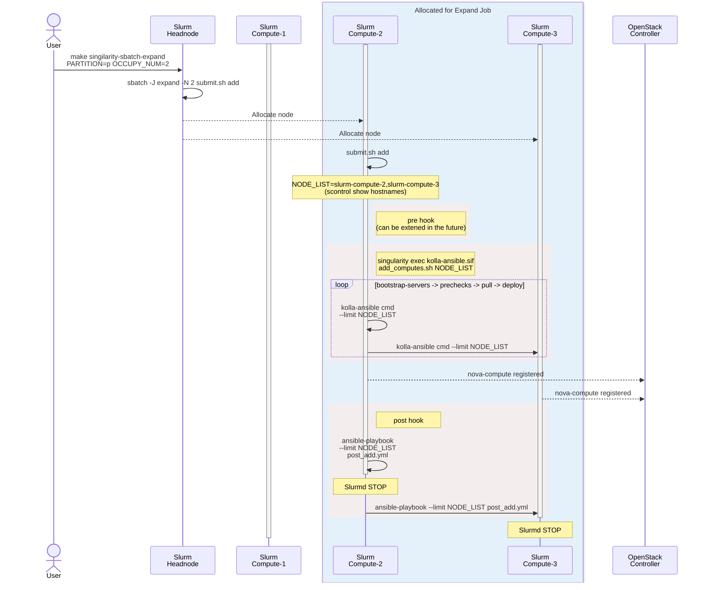
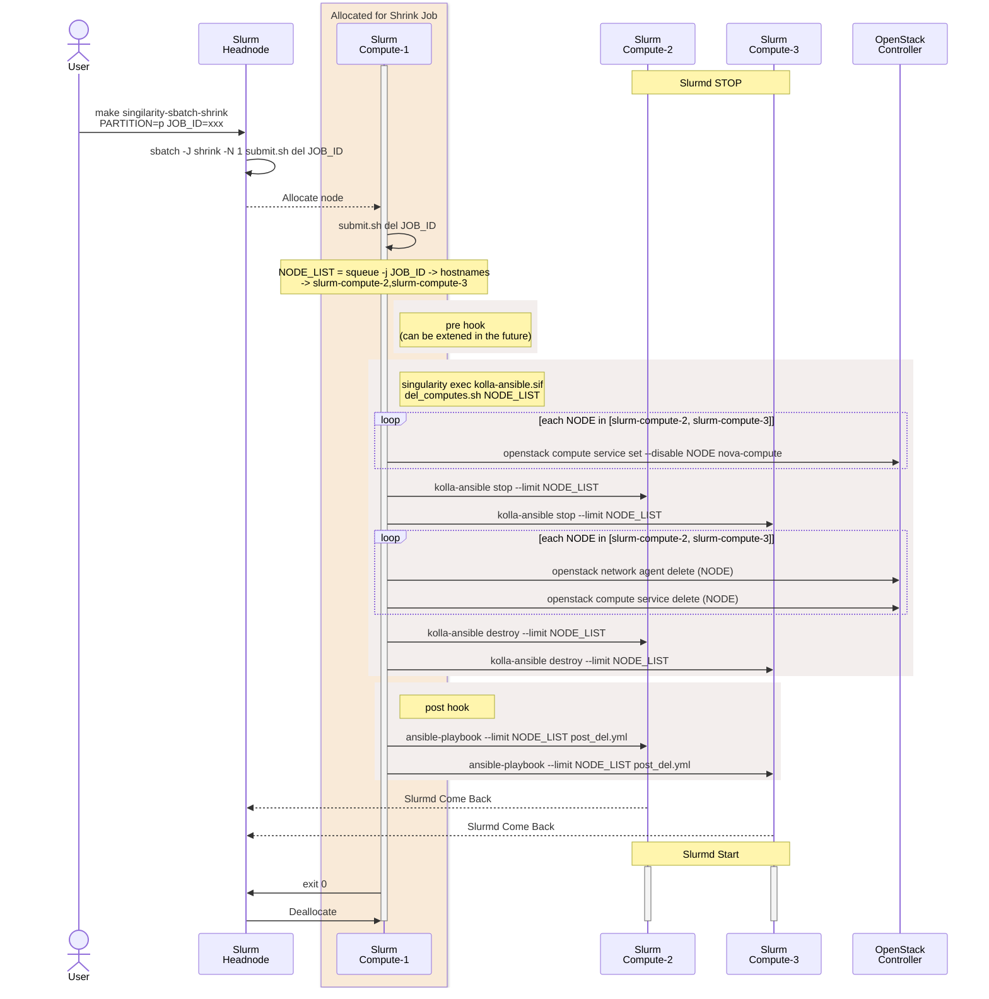

# Run Kolla-Ansible in Slurm flow

## Expand Compute Node

```mermaid
sequenceDiagram
    actor User
    participant HN as Slurm<br/>Headnode
    participant C1 as Slurm<br/>Compute-1
    box rgb(228, 240, 250) Allocated for Expand Job
        participant C2 as Slurm<br/>Compute-2
        participant C3 as Slurm<br/>Compute-3
    end
    participant Ctrl as OpenStack<br/>Controller
    %%participant OSC1 as OpenStack<br/>Compute-1
    %%participant Bastion
    activate C1
    activate C2
    activate C3
    User->>HN: make singilarity-sbatch-expand<br/>PARTITION=p OCCUPY_NUM=2
    HN->>HN: sbatch -J expand -N 2 submit.sh add
    HN-->>C2: Allocate node
    HN-->>C3: Allocate node
    C2->>C2: submit.sh add
    Note over C2: NODE_LIST=slurm-compute-2,slurm-compute-3<br/>(scontrol show hostnames)

    rect rgb(243, 238, 237)
        note right of C2: pre hook <br/> (can be extened in the future)
    end

    rect rgb(243, 238, 237)
        note right of C2: singularity exec kolla-ansible.sif<br/>add_computes.sh NODE_LIST
        loop bootstrap-servers -> prechecks -> pull -> deploy
            C2->>C2: kolla-ansible cmd <br/> --limit NODE_LIST
            C2->>C3: kolla-ansible cmd --limit NODE_LIST
        end
    end
    
    C2-->>Ctrl: nova-compute registered
    C3-->>Ctrl: nova-compute registered

    rect rgb(243, 238, 237)
        note right of C2: post hook
        C2->>C2: ansible-playbook <br/>--limit NODE_LIST <br/> post_add.yml
        deactivate C2
        Note over C2: Slurmd STOP
        C2->>C3: ansible-playbook --limit NODE_LIST post_add.yml
    end
    deactivate C3
    Note over C3: Slurmd STOP
    deactivate C1
```

## Shrink Compute Node

```mermaid
sequenceDiagram
    actor User
    participant HN as Slurm<br/>Headnode
    
    box rgb(249, 234, 216) Allocated for Shrink Job
        participant C1 as Slurm<br/>Compute-1
    end

    participant C2 as Slurm<br/>Compute-2
    participant C3 as Slurm<br/>Compute-3

    participant Ctrl as OpenStack<br/>Controller
    %%participant OSC1 as OpenStack<br/>Compute-1
    %%participant Bastion

    activate C1

    Note over C2,C3: Slurmd STOP


    User->>HN: make singilarity-sbatch-shrink<br/>PARTITION=p JOB_ID=xxx
    HN->>HN: sbatch -J shrink -N 1 submit.sh del JOB_ID
    HN-->>C1: Allocate node

    C1->>C1: submit.sh del JOB_ID
    Note over C1: NODE_LIST = squeue -j JOB_ID -> hostnames<br/>-> slurm-compute-2,slurm-compute-3

    rect rgb(243, 238, 237)
        note right of C1: pre hook <br/> (can be extened in the future)
    end

    rect rgb(243, 238, 237)
        note right of C1: singularity exec kolla-ansible.sif<br/>del_computes.sh NODE_LIST

        loop each NODE in [slurm-compute-2, slurm-compute-3]
            C1->>Ctrl: openstack compute service set --disable NODE nova-compute
        end

        C1->>C2: kolla-ansible stop --limit NODE_LIST
        C1->>C3: kolla-ansible stop --limit NODE_LIST

        loop each NODE in [slurm-compute-2, slurm-compute-3]
            C1->>Ctrl: openstack network agent delete (NODE)
            C1->>Ctrl: openstack compute service delete (NODE)
        end

        C1->>C2: kolla-ansible destroy --limit NODE_LIST
        C1->>C3: kolla-ansible destroy --limit NODE_LIST
    end

    rect rgb(243, 238, 237)
        note right of C1: post hook
        C1->>C2: ansible-playbook --limit NODE_LIST post_del.yml
        C1->>C3: ansible-playbook --limit NODE_LIST post_del.yml
    end
    C2-->> HN: Slurmd Come Back
    C3-->> HN: Slurmd Come Back
    Note over C2,C3: Slurmd Start
    activate C2
    activate C3

    C1->>HN: exit 0
    HN->>C1: Deallocate
    deactivate C1
    deactivate C2
    deactivate C3

```